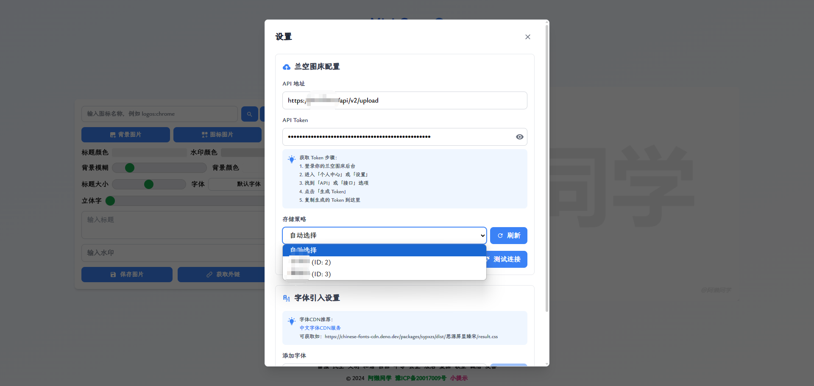

<p align="center">
  
</p>

<h1 align="center">Mini-Cover-Lsky</h1>

<p align="center">🎨 强大的在线海报封面制作工具</p>

<p align="center">
  
  
  
</p>
<p align="center">
  <a href="https://edgeone.ai/pages/new?repository-url=https%3A%2F%2Fgithub.com%2Fhloolx%2Fmini-cover-lsky&output-directory=dist&install-command=npm%20install&build-command=npm%20run%20build" target="_blank" rel="noopener noreferrer">
    
  </a>
</p>
<p align="center">🎮 在线演示：
  <a href="#" target="_blank">
  待部署
  </a>
</p>

## 📖 简介

Mini-Cover-Lsky 是一个功能强大的在线海报封面制作工具，基于 Mini-Cover 项目优化升级，集成了 LskyPro 图床功能。专为博客、短视频、社交媒体设计，提供更丰富的自定义选项和更便捷的操作体验。

## 📸 项目预览

<p align="center">
  
  <br>
  <em>新增的 LskyPro 图床配置功能，支持自定义API地址和Token管理</em>
</p>

## ✨ 核心特性

### 基础功能
- 📱 响应式设计，完美支持移动端
- 🎨 丰富的图标库，多渠道图标获取
- 🖼️ 自定义背景图片，支持拖拽和粘贴上传
- ✍️ 灵活的标题编辑，支持多种字体导入
- 💫 水印效果调整，实时预览
- 🎯 简洁的操作界面，快速上手

### 🆕 新增优化
- 🎭 **多种字体导入** - 支持导入和使用多种自定义字体，让设计更具个性
- 🖼️ **兰空图床集成** - 支持 LskyPro 图床上传，自动获取图片链接（[查看配置指南](LSKY_CONFIG.md)）
- 🎨 **增强背景功能** - 新增背景图片支持，提供更丰富的视觉效果
- 📎 **便捷图标操作** - 支持图标拖入和粘贴，操作更加流畅
- 🔍 **双渠道图标获取** - 新增两个图标获取渠道，资源更加丰富

## ⚙️ 配置说明

### 环境配置

网站基础内容通过修改 `.env` 文件自定义网站配置：

### 默认配置

在 `src/config.js` 中可以修改默认文本和字体配置：

```javascript
export const defaultConfig = {
    // 默认文本配置
    text: '默认标题',       
    watermark: '@水印文本', 

    // 字体配置
    fontFamily: import.meta.env.VITE_APP_FONT_FAMILY,
    
    // 可用字体样式列表
    fontStyles: [
        'https://font-cdn.com/font1.css',
        'https://font-cdn.com/font2.css',
        // ...
    ],
    
    // 字体选项
    fontOptions: [
        { value: 'default', label: '默认全局' },
        { value: 'Microsoft YaHei', label: '微软雅黑' },
        // ...
    ]
};
```

## 🚀 快速开始

### 环境准备

- Node.js >= 16.16.0
- NPM >= 8.15.0

### 开发调试

```bash
# 克隆项目
git clone https://github.com/hloolx/mini-cover-lsky.git

# 安装依赖
npm install

# 启动服务
npm run dev

# 构建生产版本
npm run build
```

构建产物在 `dist` 目录下，可以直接部署到任何静态资源服务器上。

## CDN赞助

本项目的 CDN 加速和安全保护由腾讯 EdgeOne 赞助
<a href="https://edgeone.ai/?from=github" target="_blank">
    最佳亚洲 CDN、Edge 和安全解决方案 - 腾讯 EdgeOne

</a>

## 👨‍💻 作者

- **阿懒同学** - [GitHub @hloolx](https://github.com/hloolx)
- **个人博客** - [www.alantx.cn](https://www.alantx.cn)

## 🙏 致谢

本项目基于 [Mini-Cover](https://github.com/JLinMr/Mini-Cover) 优化改进，感谢原项目作者的贡献。

## 📝 开源协议

[MIT License](LICENSE)
